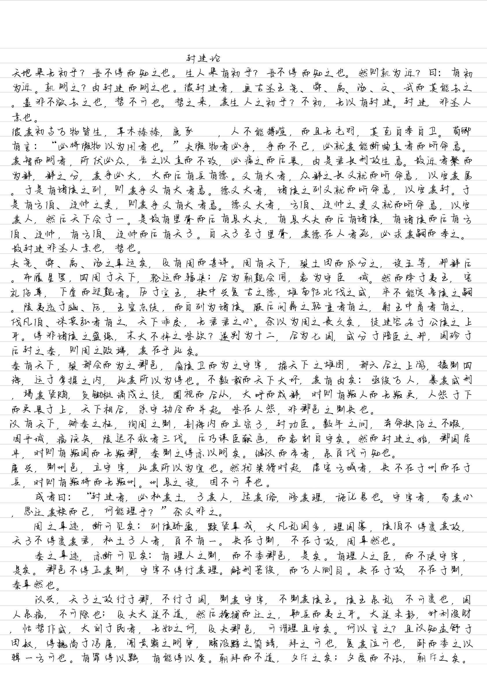

# text2handwriting
能把txt文档里的文本(particularly Chinese)转为手写体，以照片格式输出的小工具

具体效果如下：

因为是几个小时做的小项目，所以适用范围有限，有需要的朋友可以参考思路，编写适合自己需要的代码（非商用）

## 一些说明

所有用到的文件都可以在 $text2handwriting$ 文件夹内找到。

$back_picture.jpg$ 是背景图片，源代码 $handwriting.py$ 文件中的参数都是为这个背景设置的。

$life.ttf$ 和 $freedom.ttf$ 都是网上随便找的免费字体，需要的朋友也可以找自己喜欢的字体下载使用，只需要修改一下 $handwriting.py$ 文件中第 $15$ 行所用函数的第一个参数即可（例如你的字体文件名为 $myfont.ttf$，将其导入到和 $py$ 文件同一文件夹下，并将第 $15$ 行代码修改为 $font = ImageFont.truetype('myfont.ttf', 40, encoding='utf-8')$）即可。

$ text.txt $ 文件内就是你要转为手写字体的内容，需要注意的是，第一行应该是一个简短的标题（适应我自己的需要），如果不是的话，第一段是默认不会换行的，会造成文本的丢失（有需要的朋友可以自行修改代码逻辑）。
